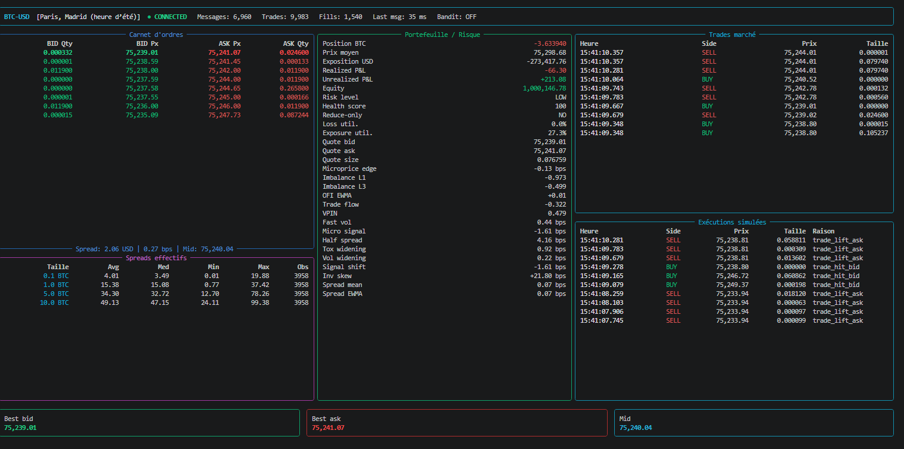
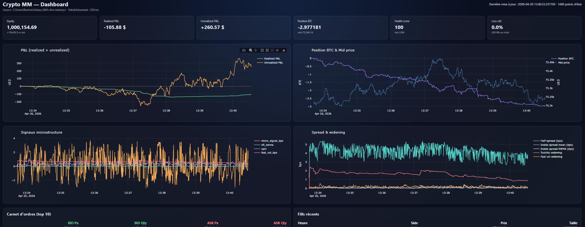
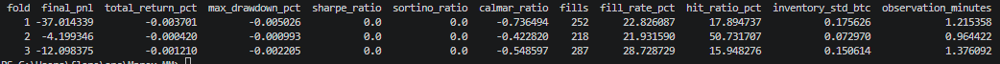
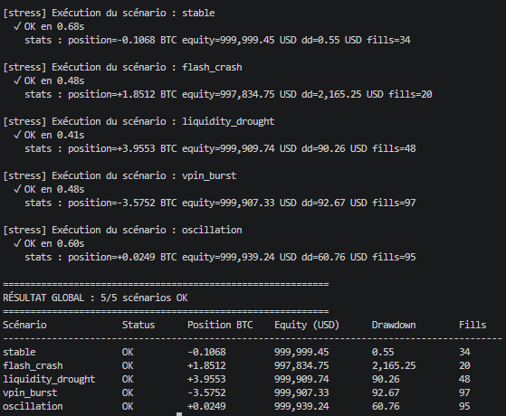
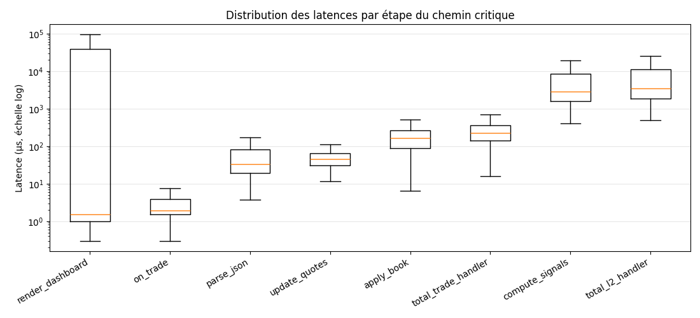

# Crypto Market Making Research Sandbox

[](#installation)
[](#testing)
[](#project-highlights)

A **crypto market making research sandbox** built around **Coinbase BTC-USD public market data**.

This repository maintains a local level-2 order book, computes microstructure features in real time, runs an inventory-aware quoting engine, simulates fills from public trades, and supports **historical replay, stress testing, and walk-forward evaluation workflows**.

The codebase aims to be readable, testable, and extensible rather than overly optimized or exchange-specific.

---

## Screenshots & Outputs

### Live terminal dashboard (Rich)



*The Rich-based dashboard shown in the terminal during a live run. Displays the top of book, effective spreads per clip size, portfolio state, risk metrics, recent trades, and simulated fills — all refreshing every 100 ms.*

### Web dashboard (Dash)



*The Dash-based web dashboard at `http://localhost:8050`. Two modes are supported: **live** (started with `--web-dashboard` alongside the live feed, reads feed memory directly, ~250 ms UI latency) and **offline** (standalone, reads CSV files). Renders P&L (realized + unrealized), position, microstructure signals, spread dynamics, a DOM-style order book (asks above / bids below with volume bars and BTC + USD depth totals), and recent fills. The browser opens automatically on startup.*

### Backtest walk-forward results



*Metrics per fold from `python -m crypto_mm.tools.backtest`: final P&L, max drawdown, fill rate, queue drag, average edge in bps, weighted edge in bps, spread captured in USD, average holding time, P&L per round-trip, inventory turnover.*

### Stress scenarios summary



*Output of `python -m crypto_mm.tools.stress` — five adversarial scenarios (stable, flash crash, liquidity drought, VPIN burst, oscillation) with invariant checks (notional cap, max loss, kill switch, health score bounds).*

### Latency profile



*Per-stage latency distribution from the `--bench-latency` flag: parse JSON, apply book updates, compute signals, update quotes, on_trade, render dashboard, total L2 handler, total trade handler.*

---

## Project Highlights

- **Live public market data ingestion** via Coinbase websocket channels
- **Local L2 order book reconstruction** with best bid / ask tracking
- **Microstructure features** including imbalance, OFI, microprice, VPIN proxy, and fast volatility
- **Inventory-aware market making logic** with adaptive spread control
- **Execution simulation layer** using queue-share heuristics on public trades
- **Risk controls** including kill switch, inventory limits, reduce-only mode, health score
- **Dual dashboards**: Rich-based terminal UI and Dash-based web UI
- **Historical replay engine** for deterministic offline experiments
- **Stress testing framework** with adversarial scenarios and invariant checks
- **Walk-forward backtesting** with a full risk metrics panel
- **Latency profiling** along the critical message-handling path
- **Analytics and diagnostics** exported to CSV and plots
- **Strong test coverage** with a lightweight and reproducible local setup

---

## Repository Structure

```text
crypto_mm/
├── main.py                 # live simulation entrypoint (CLI)
├── core/                   # pure-domain layer, no I/O
│   ├── models.py           # dataclasses : Trade, Quote, Fill
│   ├── orderbook.py        # L2 order book with caching (SortedDict)
│   ├── strategy.py         # MarketMaker quoting engine
│   ├── risk.py             # RiskManager : kill switch, reduce-only, health score
│   ├── learning.py         # optional contextual bandit
│   └── utils.py            # time helpers
├── data/                   # I/O : feed, storage, replay, analytics
│   ├── feed.py             # CoinbaseMarketDataApp (websocket runner)
│   ├── storage.py          # async CSV writer (thread-backed queue)
│   ├── replay.py           # deterministic CSV replay
│   └── analytics.py        # SpreadTracker + microstructure signals
├── tools/                  # CLI tools
│   ├── backtest.py         # walk-forward with book reconstruction
│   ├── bench.py            # latency recorder + analysis CLI
│   ├── stress.py           # adversarial scenarios + invariants
│   ├── analyze.py          # post-run P&L reconstruction from fills
│   ├── plots.py            # matplotlib charts
│   └── clean.py            # remove generated artifacts
└── ui/                     # user interfaces
    ├── config.py           # centralized Settings dataclass
    ├── console.py          # Rich terminal dashboard
    └── dash_app.py         # Dash web dashboard

tests/                      # unit tests (58 tests)
docs/images/                # screenshots referenced in README
```

---

## Installation

### 1) Clone the repository

```bash
git clone https://github.com/FlorentinBrn/crypto-market-making-marex.git
cd Marex_MM
```

### 2) Create an environment

```bash
python -m venv .venv
source .venv/bin/activate          # macOS / Linux
# .venv\Scripts\activate           # Windows
```

### 3) Install dependencies

```bash
pip install -r requirements.txt
# or in editable mode:
pip install -e .
```

Python 3.10 or newer.

---

## Quick Start

### Live simulation (Rich terminal dashboard)

```bash
python -m crypto_mm.main
```

### Live simulation with optional adaptive module (contextual bandit)

```bash
python -m crypto_mm.main --enable-bandit
```

### Live simulation with latency instrumentation

```bash
python -m crypto_mm.main --bench-latency
```

### Web dashboard (Dash)

The web dashboard supports **two modes**:

**Live mode** (recommended for active monitoring — ~250 ms UI latency, reads feed memory directly):

```bash
python -m crypto_mm.main --web-dashboard
```

The browser opens automatically at `http://localhost:8050`. Optional flags: `--web-port 9000`, `--web-host 0.0.0.0`, `--web-refresh-ms 200`.

**Offline mode** (for completed runs, or when feed and dashboard run in separate processes):

```bash
# In terminal 1 (or on a completed run):
python -m crypto_mm.main

# In terminal 2:
python -m crypto_mm.ui.dash_app --data-dir data
```

Offline mode reads the CSV files, refreshes every 1 s by default, and also opens the browser automatically. Pass `--no-open-browser` to disable.

### Run backtests on stored data

```bash
python -m crypto_mm.tools.backtest --data-dir data --n-folds 3
```

### Replay historical sessions

```bash
python -m crypto_mm.data.replay --data-dir data --speed 10
python -m crypto_mm.data.replay --data-dir data --speed inf --bench-latency
```

### Run stress scenarios

```bash
python -m crypto_mm.tools.stress
python -m crypto_mm.tools.stress --scenario flash_crash
```

### Latency analysis (post-run)

```bash
python -m crypto_mm.tools.bench --data-dir data
```

### Post-trade analytics

```bash
python -m crypto_mm.tools.analyze --data-dir data
```

### Clean generated data and cache folders

```bash
python -m crypto_mm.tools.clean
```

---

## Testing

```bash
pytest -q
```

Current status: **58 tests passed**.

---

## Research Workflow

A typical workflow with this repository:

1. **Collect or replay market data**
2. **Run the quoting engine** with a chosen configuration
3. **Store fills, state, spreads, and PnL paths**
4. **Watch the live dashboards** (terminal and/or web)
5. **Replay sessions deterministically** to inspect behavior
6. **Stress the strategy** under adverse scenarios
7. **Analyze outcomes** through CSV exports and plots
8. **Tune parameters** using walk-forward evaluation

This makes the project suitable for experimenting with:

- spread adaptation rules
- inventory penalties
- fill assumptions
- volatility-aware quoting
- toxicity filters
- stress robustness
- contextual bandits or lightweight RL extensions

---

## Stress Testing Examples

Example scenarios that can be simulated:

- **flash_crash** — sudden -500 bps drop in 2 s with partial rebound
- **liquidity_drought** — bid side nearly disappears for several seconds
- **vpin_burst** — 100% one-sided aggressor flow
- **oscillation** — high-frequency sinusoidal volatility
- **stable** — calm baseline for comparison

Each scenario checks: notional cap ≤ $1M, drawdown ≤ $100k, kill-switch activation, health score in [0, 100].

---

## Replay Engine Benefits

Historical replay allows:

- deterministic debugging
- side-by-side parameter comparison
- reproducible P&L analysis
- quote behavior inspection
- signal validation on past sessions

Replay is often the fastest path to improving execution logic before testing live.

---

## Example Outputs

The project can generate:

- P&L curves from simulated fills
- spread history charts
- walk-forward equity curves
- stress scenario comparisons
- latency distributions
- replay diagnostics
- microstructure state histories

---

## Engineering Notes

The codebase favors:

- explicit module boundaries (`core` / `data` / `tools` / `ui`)
- simple dependencies
- testable components (pure `core` has no I/O, no network)
- local reproducibility
- readable implementation over unnecessary abstraction

In a trading context, clarity and debuggability are often more valuable than cleverness.

---

## Limitations

This repository is a **research and educational project**.

In particular, it does **not** claim to provide:

- real exchange connectivity for order routing
- production-grade latency guarantees
- exact queue position modeling
- slippage and fee realism across all market regimes
- compliance, monitoring, or deployment hardening

---

## Ideas for Future Improvements

- richer queue position modeling
- explicit maker / taker fee schedules
- multi-asset or cross-venue support
- stronger regime detection features
- more realistic event-driven replay engine
- Monte Carlo stress scenario generator
- experiment tracking for parameter sweeps
- WebSocket auto-reconnect with gap replay
